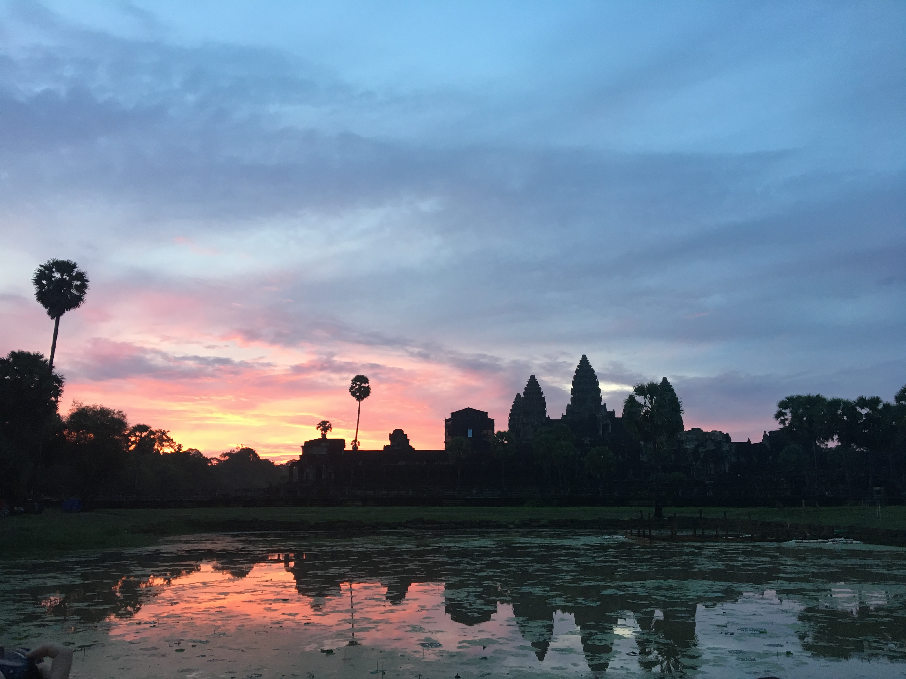

> 我，一个充满理想和憧憬自由的放浪青年

<figure style="width: auto;">
    
    <figcaption>- 2018年毕业旅行，摄于小吴哥</figcaption>
</figure>

92年出生的人，生活在一个世界激烈变化的年代。前一年的圣诞节，世界的另一个超级老大哥刚刚结束了其70余年的寿命，正式宣告与世长辞。那一年的初春，一位老人为稳定各方局势，展开为期一个多月的南巡讲话，为国内的发展路线，定下了坚实的基调。中国进入了前所未有的快速发展时期。

生于90年代的中国小孩无疑是幸福和痛苦的。他们既享受了发达的市场经济带来的丰富物质生活，也背负了高房价，高物价，高老年化社会带来的压力。而我就是出生于90年代的万千少年的其中之一。

92年的我，出生在四川一个较远的少数民族地区。具体有多远呢？在没有通公路的年代，以脚步来衡量从市区到我家的距离，需要在路上过上一夜。那个年代的道路崎岖又难走，还需要时刻防备野兽或者强盗的袭击，一不小心就会把命丢在路上。所以大多数人都选择结伴出行。

我的爷爷和奶奶，就是当时随军支边建设的有志青年之一。约莫也是我现在的年纪。我一直是一个坚定的历史唯物主义者，认为分析一个人个人性格的时候，不能跳脱具体的生活年代。一个年代的时代特征会给那个时代生活的人，打上历史的烙印。包括后来生活于文革前后的父母们，也包括生活于后改革开放时期的我们。

然而非要说起90年代出生的人具有何种时代特征，我觉得也是无从谈起的。第一，生活在这个年代的人往往具有盲目性，无法看清自己生活时代的本质，无法进行归纳和总结。第二，总会有好事者认为自己不是那么回事，非要对某一些细枝末节的事情斤斤计较。但是，我认为有一点是可以肯定的。那就是90后出生的人并不是之前某些人口中所说的“垮掉的一代”，而是积极向上的一代，是某些人口中“后浪”的一代。

这一代是充满理想和向往自由的一代，坚信国家的发展会在自己的一言一行中变得更好。这一带也是砥砺前行的一代，背负着沉重的贷款压力和996的工作强度依然向往美好生活的一代。这一代也是迷茫的一代，站在人生的十字路口，看不清未来方向的一代。

而我，有幸置身于这一时代。